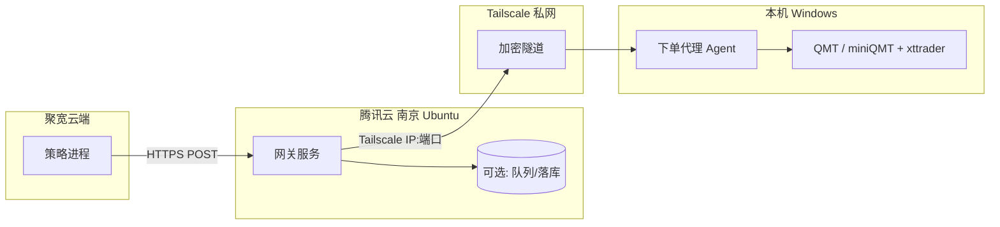

# 聚宽信号 → 南京网关 → Windows/QMT 执行 — 设计说明

## 1. 背景与目标

- **聚宽**：继续在云端运行策略，在产生交易意图时通过 **HTTPS** 向外发送结构化请求（与现有飞书 Webhook 方式同类）。
- **腾讯云南京（Ubuntu）**：作为 **公网入口**，接收聚宽请求，完成鉴权与简单业务逻辑，再通过 **Tailscale 私网** 将指令转发到本机。
- **Windows**：运行 **QMT（miniQMT 已登录）** 及轻量 **下单代理**，将网关下发的「意图」转换为 **xtquant 交易接口** 的实际委托，并可选回传执行结果。

**设计原则**：公网只暴露南京节点；Windows 不直接对公网开放交易端口；全链路可审计、可幂等、可观测。

---

## 2. 总体架构

**请求路径**：聚宽 →（公网）→ 南京网关 →（Tailscale）→ Windows Agent → QMT。

**说明**：聚宽进程 **无法** 加入 Tailscale，因此 **必须** 经由南京的公网可达地址；Tailscale 仅用于 **南京 ↔ Windows** 之间的可信通道。

---

## 3. 组件职责划分

### 3.1 聚宽侧（简述）

| 职责 | 说明 |
|------|------|
| 计算信号 | 保持现有策略逻辑。 |
| 构造 payload | 统一字段：如 `strategy_id`、`intent_id`（幂等键）、`symbol`、`side`、`quantity` 或 `target_weight`、`order_type`、`time_sent`、可选 `reason`/`bar_time`。 |
| HTTP 调用 | `POST` 至南京网关 **HTTPS** 地址；设置合理超时（如 5～15s）；失败时记录日志或降级（如仍推飞书告警）。 |
| 密钥 | 使用网关下发的 **API Key** 或 **HMAC 签名**（推荐签名，避免密钥在 URL 中泄露）。 |

聚宽侧 **不负责** 与 QMT 直接通信。

---

### 3.2 南京服务器（Ubuntu）

**定位**：公网 API 网关 + 可选持久化/队列 + 到 Windows 的转发。

| 功能模块 | 职责 |
|----------|------|
| **HTTPS 接入** | 绑定公网域名，TLS 证书（Let’s Encrypt 等）；仅暴露必要路径（如 `/v1/intents`）。 |
| **鉴权** | 校验 `Authorization: Bearer <token>` 或 `X-Signature` + 时间戳防重放；拒绝未授权与过期请求。 |
| **请求校验** | JSON Schema / Pydantic：必填字段、枚举值（买卖方向、订单类型）、数量上下限、股票代码格式（如 `600000.SH`）。 |
| **幂等与去重** | 以 `intent_id`（或 `strategy_id + bar_time + symbol + side` 组合）为键，短期缓存（Redis）或 DB 唯一约束，重复请求返回同一结果，**不重复转发**。 |
| **转发到 Windows** | 通过 Tailscale 解析 Windows 节点名或固定 Tailscale IP，向 Agent 的 **内网监听地址** 发起 HTTP（或 gRPC，本文以 HTTP 为例）。 |
| **超时与重试** | 调用 Agent 设置较短超时；失败时可 **有限次重试**（注意与幂等配合）；超过阈值进入死信或告警。 |
| **日志与审计** | 结构化日志（请求 ID、intent_id、结果码）；可选落库（PostgreSQL/SQLite）便于事后核对。 |
| **限流** | 按 IP 或 API Key 限流，防止误触或滥用。 |
| **健康检查** | `GET /health` 供监控；可扩展检查 Tailscale 连通性、Agent 可达性（慎用，避免耦合过紧）。 |
| **可选：飞书通知** | 与现习惯一致：网关在处理完成或失败时 **额外** Webhook 通知，便于手机查看。 |

**不建议** 在南京直接调用 QMT：QMT 与 xtquant 强依赖 Windows 本机环境与登录会话，南京仅作 **中继**。

**推荐技术栈（可选）**：Python FastAPI / Go Gin + `nginx` 终结 TLS + `systemd` 托管；幂等/队列可用 Redis；证书用 `certbot`。

---

### 3.3 Windows 本机

**定位**：Tailscale 内的 **唯一执行端**，将「已通过南京鉴权的意图」转为真实委托。

| 功能模块 | 职责 |
|----------|------|
| **Agent 服务** | 监听 **仅 Tailscale 网卡或 127.0.0.1**（若南京通过 Tailscale 访问本机端口）；接收南京转发的 HTTP 请求。 |
| **二次校验** | 可选：与南京共享密钥的签名，防止 Tailscale 被误配时来自非网关的流量；本地风控（单笔上限、标的白名单、交易时段）。 |
| **QMT / xtquant** | 使用 `xttrader`（及文档要求的连接方式）下单、查资金、查持仓；保证 **miniQMT 已登录**、Python 版本与券商要求一致。 |
| **执行结果回传** | 将委托号、状态、错误信息通过 HTTP 响应返回南京；南京再聚合返回聚宽（若聚宽需要同步结果）或仅记录日志。 |
| **进程守护** | 使用 NSSM、`srvany` 或任务计划「登录时启动」，确保 Agent 与 QMT 生命周期策略一致（例如用户登录后启动）。 |
| **日志** | 本地文件或 Windows 事件；敏感信息脱敏。 |

**与现有 `qmt_data_server` 的关系**：行情 HTTP 服务可继续独立运行；Agent **专注交易**，避免与行情服务混在同一进程导致重启影响面过大（也可同机不同端口）。

**本仓库参考实现**：

- `windows/`：Agent（FastAPI + XtQuantTrader，`POST /internal/execute`）。
- `gateway/`：网关（FastAPI + httpx 转发 `POST /v1/intents`）；可在 **本机 Windows** 与 Agent 联调，也可部署到南京。

---

## 4. 接口分层（概念）

### 4.1 聚宽 → 南京（公网）

- **方法**：`POST /v1/intents`（路径可自定义）
- **Body**：JSON，含幂等键、标的、方向、数量/目标、时间等（见 3.1）。
- **响应**：`202 Accepted` + `request_id`，或 `200` + 简要状态；错误时 `4xx/5xx` + 明确 `error_code`。

### 4.2 南京 → Windows Agent（Tailscale）

- **方法**：`POST /internal/execute`（仅 Tailscale 可达）
- **Body**：与上游一致或经网关归一化后的内部格式；可附加 `gateway_request_id`。
- **响应**：实际下单结果（成功/失败原因、券商返回码等）。

南京 **不应** 把公网路径直接映射到 Windows；内网路径可不同，并采用 **更强** 或 **第二层** 鉴权。

---

## 5. 安全摘要

| 项目 | 建议 |
|------|------|
| 传输 | 聚宽→南京 **全程 HTTPS**；南京→Agent 在 Tailscale 内仍建议 **HTTPS 或 mTLS**（按运维成本选择）。 |
| 鉴权 | 公网用强随机 Token 或 HMAC；内网 Agent 校验来自网关的凭证。 |
| 暴露面 | Windows 防火墙禁止公网访问 Agent 端口；仅允许 Tailscale 接口或南京固定源（若经跳转）。 |
| 密钥 | 聚宽、南京、Windows 分环境配置；轮换时双轨短暂并存。 |

---

## 6. 可靠性与运维

- **Windows/QMT 离线**：南京返回明确错误；可选入队延迟重试（需注意交易时效，避免收盘后误单）。
- **幂等**：同一 `intent_id` 重复 POST，全链路只应产生 **一笔** 有效委托（或明确返回「已处理」）。
- **对账**：日终用网关日志 + Agent 日志 + QMT 交割单核对。
- **监控**：南京可用云监控 + 健康检查；执行结果飞书推送作为人工兜底。

---

## 7. 待办与扩展（可选）

- [ ] 向聚宽确认实盘/模拟盘对 **自定义 HTTPS 目标** 的持续政策（与飞书 webhook 并列评估）。
- [ ] 定义 **OpenAPI/JSON Schema** 作为聚宽、网关、Agent 的契约。
- [ ] 南京 `GET /api/v1/market/status` 类能力是否与执行联动（避免非交易时段误发）——可与本地或 `qmt_data_server` 的交易日历策略对齐。
- [ ] 灾备：网关双实例、Redis 主从等（按资金规模与严肃程度迭代）。

---

## 8. 文档维护

- 本文档路径：`docs/joinquant-qmt-relay-design.md`
- 若接口字段或部署方式变更，请同步更新本文档与仓库内 OpenAPI（若存在）。
